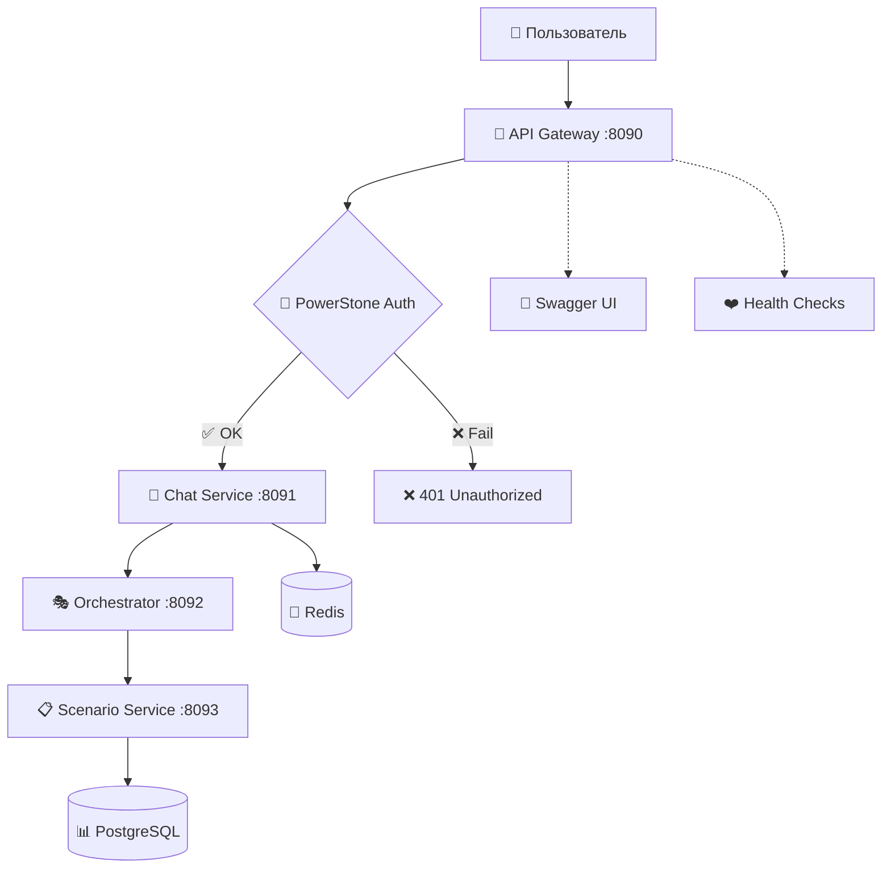
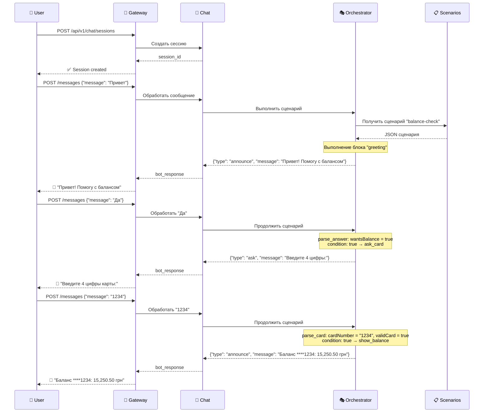
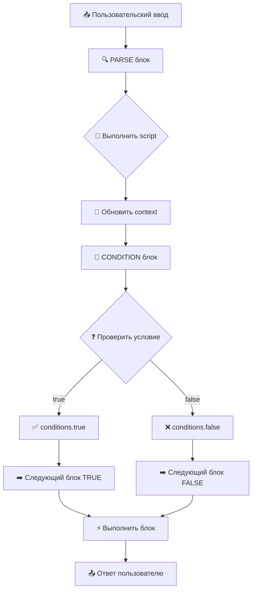
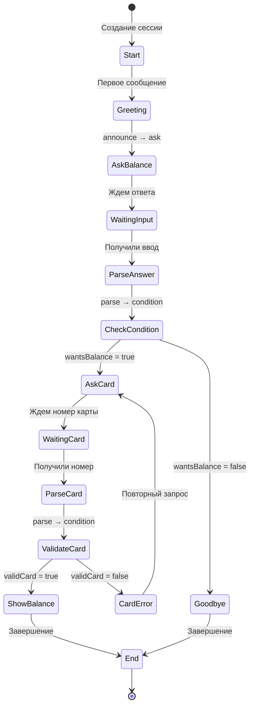

# Архитектура Chatbot Platform

## 🏗️ Общая схема сервисов



## 🎭 Структура сценария

```mermaid
graph TD
    Start([🚀 START]) --> Greeting[📢 greeting<br/>announce<br/>"Привет! Помогу с балансом"]
    
    Greeting --> AskBalance[❓ ask_balance<br/>ask<br/>"Хотите проверить баланс? (да/нет)"]
    
    AskBalance --> ParseAnswer[🔍 parse_answer<br/>parse<br/>context.wantsBalance = да/нет]
    
    ParseAnswer --> Condition{🔀 check_answer<br/>condition<br/>wantsBalance == true?}
    
    Condition -->|✅ ДА| AskCard[❓ ask_card<br/>ask<br/>"Введите 4 цифры карты:"]
    Condition -->|❌ НЕТ| Goodbye[👋 goodbye<br/>announce<br/>"Обращайтесь еще!"]
    
    AskCard --> ParseCard[🔍 parse_card<br/>parse<br/>context.cardNumber = input<br/>validCard = /\d{4}/.test()]
    
    ParseCard --> ValidateCard{🔀 validate_card<br/>condition<br/>validCard == true?}
    
    ValidateCard -->|✅ OK| ShowBalance[💰 show_balance<br/>announce<br/>"Баланс ****{cardNumber}: 15,250.50 грн"]
    ValidateCard -->|❌ Error| CardError[⚠️ card_error<br/>announce<br/>"Неверный формат"]
    
    CardError --> AskCard
    ShowBalance --> End([🏁 END])
    Goodbye --> End
    
    style Start fill:#e1f5fe
    style End fill:#f3e5f5
    style Condition fill:#fff3e0
    style ValidateCard fill:#fff3e0
```

## 🔄 Поток выполнения сценария



## 📊 Структура JSON сценария

```json
{
  "id": "balance-check-001",
  "name": "Проверка баланса карты",
  "start_node": "greeting",
  "nodes": [
    {
      "id": "greeting",
      "type": "announce",
      "parameters": {"message": "Привет! Помогу с балансом"},
      "next_nodes": ["ask_balance"]
    },
    {
      "id": "ask_balance", 
      "type": "ask",
      "parameters": {"question": "Хотите проверить баланс? (да/нет)"},
      "next_nodes": ["parse_answer"]
    },
    {
      "id": "parse_answer",
      "type": "parse",
      "parameters": {"script": "context.wantsBalance = input.includes('да')"},
      "next_nodes": ["check_answer"]
    },
    {
      "id": "check_answer",
      "type": "condition", 
      "parameters": {"condition": "context.wantsBalance == true"},
      "conditions": {
        "true": "ask_card",
        "false": "goodbye"
      }
    }
  ],
  "context": {"wantsBalance": false, "cardNumber": null}
}
```

## 🎯 Типы блоков и их логика

### 📢 ANNOUNCE - Объявление
```
Вход: context
Действие: Показать сообщение пользователю
Выход: message + next_node
```

### ❓ ASK - Запрос ввода
```
Вход: context
Действие: Задать вопрос, ждать ответа
Выход: question + waiting_for_input = true
```

### 🔍 PARSE - Обработка ввода
```
Вход: user_input + context
Действие: Выполнить script, обновить context
Выход: updated_context + next_node
```

### 🔀 CONDITION - Условие
```
Вход: context
Действие: Проверить условие
Выход: next_node (true/false path)
```

## 🧠 Логика выбора ответов



## 🔧 Примеры условий

### Простые условия:
```javascript
// Проверка согласия
context.wantsBalance == true

// Валидация карты  
context.validCard == true

// Проверка результата парсинга
parse_result == true
```

### Сложные условия:
```javascript
// Множественная проверка
context.wantsBalance == true && context.hasCard == true

// Проверка значений
context.amount > 0 && context.amount <= 10000

// Строковые операции
context.userInput.toLowerCase().includes('да')
```

## 📈 Состояние сессии



## 🚀 Статус реализации

### ✅ Работает:
- **API Gateway** - авторизация, проксирование
- **Chat Service** - сессии, сообщения  
- **Scenario Service** - CRUD сценариев

### ⚠️ В разработке:
- **Orchestrator** - выполнение сценариев (требует доработки)

### 📋 Готово к интеграции:
- JSON структура сценариев
- Документация по блокам
- Схемы архитектуры
- Примеры диалогов
