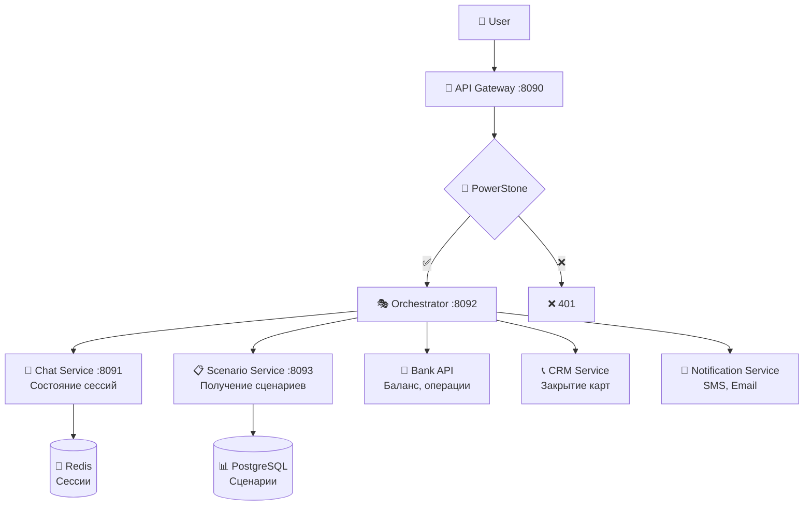
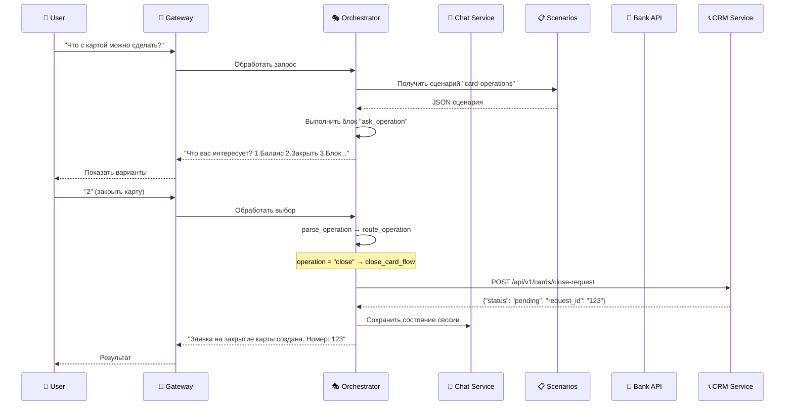

# 🔧 Правильная архитектура и множественные варианты

## ❌ Текущая неправильная схема

```
👤 User → 🚪 Gateway → 💬 Chat Service → 🎭 Orchestrator → 📋 Scenarios
```

**Проблемы:**
- Chat Service не должен управлять сценариями
- Orchestrator должен быть центральным координатором
- Нет возможности вызывать внешние сервисы

## ✅ Правильная архитектура



## 🎯 Множественные варианты ответов

### Пример сценария с 3+ вариантами:

```json
{
  "id": "card-operations-001",
  "name": "Операции с картой",
  "start_node": "greeting",
  "nodes": [
    {
      "id": "ask_operation",
      "type": "ask",
      "parameters": {
        "question": "Что вас интересует?",
        "options": [
          {"value": "balance", "text": "1. Проверить баланс"},
          {"value": "close", "text": "2. Закрыть карту"},
          {"value": "block", "text": "3. Заблокировать карту"},
          {"value": "history", "text": "4. История операций"},
          {"value": "support", "text": "5. Связаться с поддержкой"}
        ],
        "inputType": "choice"
      },
      "next_nodes": ["parse_operation"]
    },
    {
      "id": "parse_operation",
      "type": "parse",
      "parameters": {
        "script": "context.operation = input.toLowerCase(); context.validChoice = ['balance', 'close', 'block', 'history', 'support', '1', '2', '3', '4', '5'].includes(input.toLowerCase());"
      },
      "next_nodes": ["route_operation"],
      "conditions": {
        "error": "ask_operation"
      }
    },
    {
      "id": "route_operation",
      "type": "condition",
      "parameters": {
        "condition": "context.validChoice == true"
      },
      "conditions": {
        "balance": "check_balance_flow",
        "1": "check_balance_flow",
        "close": "close_card_flow", 
        "2": "close_card_flow",
        "block": "block_card_flow",
        "3": "block_card_flow",
        "history": "history_flow",
        "4": "history_flow",
        "support": "support_flow",
        "5": "support_flow",
        "false": "invalid_choice"
      }
    },
    {
      "id": "close_card_flow",
      "type": "api-request",
      "parameters": {
        "service": "crm-service",
        "endpoint": "/api/v1/cards/close-request",
        "method": "POST",
        "data": {
          "card_number": "{context.cardNumber}",
          "user_id": "{context.userId}",
          "reason": "user_request"
        }
      },
      "next_nodes": ["confirm_close"],
      "conditions": {
        "success": "confirm_close",
        "error": "close_error"
      }
    },
    {
      "id": "check_balance_flow",
      "type": "api-request", 
      "parameters": {
        "service": "bank-api",
        "endpoint": "/api/v1/accounts/balance",
        "method": "GET",
        "headers": {
          "Authorization": "Bearer {context.bankToken}"
        }
      },
      "next_nodes": ["show_balance"],
      "conditions": {
        "success": "show_balance",
        "error": "balance_error"
      }
    }
  ]
}
```

## 🔀 Расширенная логика условий

### Множественное ветвление:
```json
{
  "id": "multi_condition",
  "type": "condition",
  "parameters": {
    "condition": "context.operation"
  },
  "conditions": {
    "balance": "balance_scenario",
    "close": "close_scenario", 
    "block": "block_scenario",
    "history": "history_scenario",
    "support": "support_scenario",
    "default": "unknown_operation"
  }
}
```

### Сложные условия:
```json
{
  "id": "complex_condition",
  "type": "condition",
  "parameters": {
    "condition": "context.userType == 'premium' && context.balance > 10000"
  },
  "conditions": {
    "true": "premium_service",
    "false": "standard_service"
  }
}
```

## 🎭 Новые типы блоков

### 🌐 API-REQUEST - Вызов внешних сервисов
```json
{
  "id": "call_bank_api",
  "type": "api-request",
  "parameters": {
    "service": "bank-api",
    "endpoint": "/api/v1/balance",
    "method": "GET",
    "timeout": 5000,
    "retry": 3
  },
  "conditions": {
    "success": "show_result",
    "timeout": "timeout_error", 
    "error": "api_error"
  }
}
```

### 🔄 SUB-FLOW - Подсценарии
```json
{
  "id": "close_card_subflow",
  "type": "sub-flow",
  "parameters": {
    "scenario_id": "card-closure-001",
    "inherit_context": true
  },
  "conditions": {
    "completed": "return_to_main",
    "cancelled": "ask_operation"
  }
}
```

### 📧 NOTIFICATION - Уведомления
```json
{
  "id": "send_sms",
  "type": "notification",
  "parameters": {
    "type": "sms",
    "template": "card_blocked",
    "recipient": "{context.userPhone}",
    "data": {
      "card_number": "{context.cardNumber}",
      "timestamp": "{context.blockTime}"
    }
  },
  "next_nodes": ["confirm_notification"]
}
```

## 🔄 Правильный поток выполнения



## 🛠️ Изменения в коде

### Orchestrator как главный координатор:
```java
@Path("/api/v1/orchestrator")
public class OrchestratorController {
    
    @Inject ChatServiceClient chatClient;
    @Inject ScenarioServiceClient scenarioClient;
    @Inject BankApiClient bankClient;
    @Inject CrmServiceClient crmClient;
    
    @POST
    @Path("/process")
    public Response processMessage(ProcessRequest request) {
        // 1. Получить сценарий
        Scenario scenario = scenarioClient.getScenario(request.scenarioId);
        
        // 2. Получить контекст сессии
        SessionContext context = chatClient.getSessionContext(request.sessionId);
        
        // 3. Выполнить блок сценария
        ExecutionResult result = executeScenarioBlock(scenario, request.userInput, context);
        
        // 4. Вызвать внешние сервисы если нужно
        if (result.requiresApiCall()) {
            result = callExternalService(result);
        }
        
        // 5. Сохранить обновленный контекст
        chatClient.updateSessionContext(request.sessionId, result.getContext());
        
        return Response.ok(result).build();
    }
}
```

### Gateway перенаправляет в Orchestrator:
```java
@Path("/api/v1/chat")
public class GatewayController {
    
    @Inject OrchestratorClient orchestratorClient;
    
    @POST
    @Path("/messages")
    public Response sendMessage(MessageRequest request) {
        // Перенаправить в Orchestrator вместо Chat Service
        return orchestratorClient.processMessage(request);
    }
}
```

## ✅ Ответы на вопросы

### 1. **Вызовы из Orchestrator** - ДА, ты прав!
- Orchestrator должен быть центральным координатором
- Он вызывает Chat Service для состояния
- Он вызывает Scenario Service для сценариев  
- Он вызывает внешние API для бизнес-логики

### 2. **Множественные варианты** - ДА, возможно!
- Блок `condition` поддерживает множественные пути
- Можно использовать `conditions` объект с любым количеством вариантов
- Новый тип блока `api-request` для вызова внешних сервисов
- Поддержка подсценариев через `sub-flow`

**Вывод**: Текущая архитектура требует переработки. Orchestrator должен стать главным, а множественные варианты уже поддерживаются структурой JSON.
