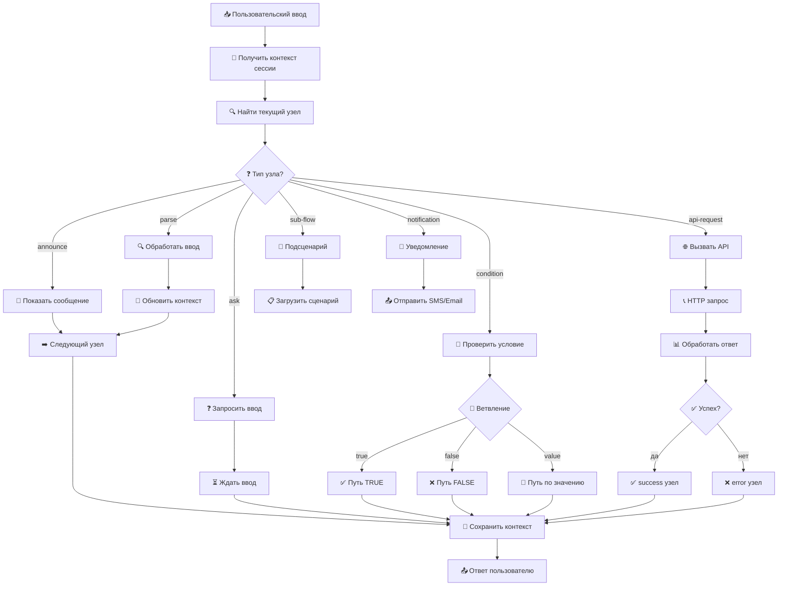

# 🎭 Как определяются типы узлов и API вызовы

## 🔍 Текущая проблема

**Сейчас**: Все запросы идут в простую функцию `generateResponse()`
```java
private String generateResponse(String userInput) {
    if (msg.contains("привет")) return "Привет! Что вас интересует?";
    if (msg.contains("1")) return "Баланс карты: 15,250.50 грн";
    // ...
}
```

**Должно быть**: ScenarioEngine определяет тип узла и выполняет соответствующую логику

## 🎯 Правильный поток выполнения



## 🔧 Реализация в коде

### 1. **ScenarioEngine.executeNodeByType()**
```java
private Map<String, Object> executeNodeByType(ScenarioBlock node, String userInput, 
                                             Map<String, Object> context, Scenario scenario) {
    switch (node.type.toLowerCase()) {
        case "announce":
            return executeAnnounce(node, context, scenario);
        case "ask":
            return executeAsk(node, context, scenario);
        case "parse":
            return executeParse(node, userInput, context, scenario);
        case "condition":
            return executeCondition(node, context, scenario);
        case "api-request":  // ← ВОТ ТУТ API ВЫЗОВЫ!
            return executeApiRequest(node, context, scenario);
        // ...
    }
}
```

### 2. **API Request узел**
```java
private Map<String, Object> executeApiRequest(ScenarioBlock node, Map<String, Object> context, Scenario scenario) {
    String service = (String) node.parameters.get("service");      // "bank-api"
    String endpoint = (String) node.parameters.get("endpoint");    // "/api/v1/balance"
    String method = (String) node.parameters.get("method");        // "GET"
    
    // Определяем URL сервиса
    String serviceUrl = getServiceUrl(service);  // http://localhost:8094
    
    // Делаем HTTP запрос
    HttpResponse<String> response = httpClient.send(request, HttpResponse.BodyHandlers.ofString());
    
    // Определяем следующий узел по результату
    String nextNode;
    if (response.statusCode() == 200) {
        nextNode = (String) node.conditions.get("success");  // "show_balance"
    } else {
        nextNode = (String) node.conditions.get("error");    // "balance_error"
    }
    
    return createResponse("api-request", "API call completed", nextNode, context);
}
```

### 3. **Condition узел для множественного ветвления**
```java
private Map<String, Object> executeCondition(ScenarioBlock node, Map<String, Object> context, Scenario scenario) {
    String condition = (String) node.parameters.get("condition");  // "context.operation"
    
    // Получаем значение переменной
    String conditionValue = getConditionValue(condition, context);  // "balance"
    
    // Ищем соответствующий путь
    String nextNode = (String) node.conditions.get(conditionValue);
    
    // Маппинг путей:
    // "balance" → "balance_api"
    // "close" → "close_api" 
    // "block" → "block_api"
    // "history" → "history_api"
    // "support" → "support_flow"
    
    return createResponse("condition", "Condition evaluated", nextNode, context);
}
```

## 📋 Пример JSON сценария с API

```json
{
  "nodes": [
    {
      "id": "route_operation",
      "type": "condition",
      "parameters": {"condition": "context.operation"},
      "conditions": {
        "balance": "balance_api",
        "close": "close_api",
        "block": "block_api"
      }
    },
    {
      "id": "balance_api",
      "type": "api-request",
      "parameters": {
        "service": "bank-api",
        "endpoint": "/api/v1/accounts/balance",
        "method": "GET",
        "headers": {
          "Authorization": "Bearer {context.bankToken}",
          "Card-Number": "{context.cardNumber}"
        }
      },
      "conditions": {
        "success": "show_balance",
        "error": "balance_error"
      }
    },
    {
      "id": "close_api",
      "type": "api-request",
      "parameters": {
        "service": "crm-service",
        "endpoint": "/api/v1/cards/close-request",
        "method": "POST",
        "data": {
          "card_number": "{context.cardNumber}",
          "user_id": "{context.userId}",
          "reason": "user_request"
        }
      },
      "conditions": {
        "success": "close_success",
        "error": "close_error"
      }
    }
  ]
}
```

## 🌐 Маппинг сервисов

```java
private String getServiceUrl(String service) {
    switch (service) {
        case "bank-api":
            return "http://localhost:8094";     // Банковский API
        case "crm-service":
            return "http://localhost:8095";     // CRM система
        case "notification-service":
            return "http://localhost:8096";     // SMS/Email сервис
        default:
            return "http://localhost:8080";
    }
}
```

## 🔄 Полный пример выполнения

### Шаг 1: Пользователь выбирает "1" (баланс)
```
Input: "1"
Current Node: "parse_operation" (type: parse)
→ Execute: executeParse() 
→ Script: context.operation = "balance"
→ Next Node: "route_operation"
```

### Шаг 2: Условное ветвление
```
Current Node: "route_operation" (type: condition)
→ Execute: executeCondition()
→ Condition: context.operation = "balance"
→ Next Node: "balance_api"
```

### Шаг 3: API вызов
```
Current Node: "balance_api" (type: api-request)
→ Execute: executeApiRequest()
→ HTTP GET: http://localhost:8094/api/v1/accounts/balance
→ Response: 200 OK {"balance": "15,250.50", "currency": "грн"}
→ Next Node: "show_balance" (success path)
```

### Шаг 4: Показ результата
```
Current Node: "show_balance" (type: announce)
→ Execute: executeAnnounce()
→ Message: "Баланс карты: {api_response.balance} {api_response.currency}"
→ Result: "Баланс карты: 15,250.50 грн"
```

## ✅ Ответ на вопрос

**Где определяется тип узла?** 
- В `ScenarioEngine.executeNodeByType()` через `switch (node.type)`

**Где происходят API вызовы?**
- В методе `executeApiRequest()` для узлов типа `"api-request"`

**Как определяется следующий шаг?**
- Через `node.conditions` в зависимости от результата (success/error/true/false/значение)

**Текущий статус:**
- ✅ Создан `AdvancedScenarioEngine` с полной логикой
- ⚠️ Orchestrator пока использует простую заглушку
- 🔄 Нужно переключить на настоящий engine
