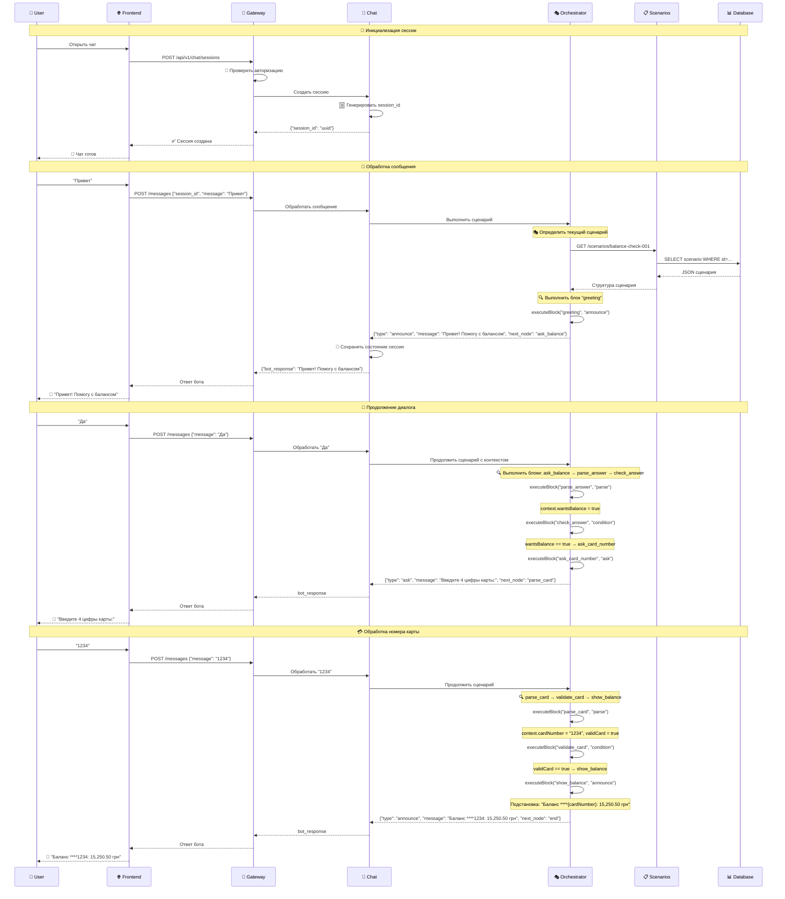
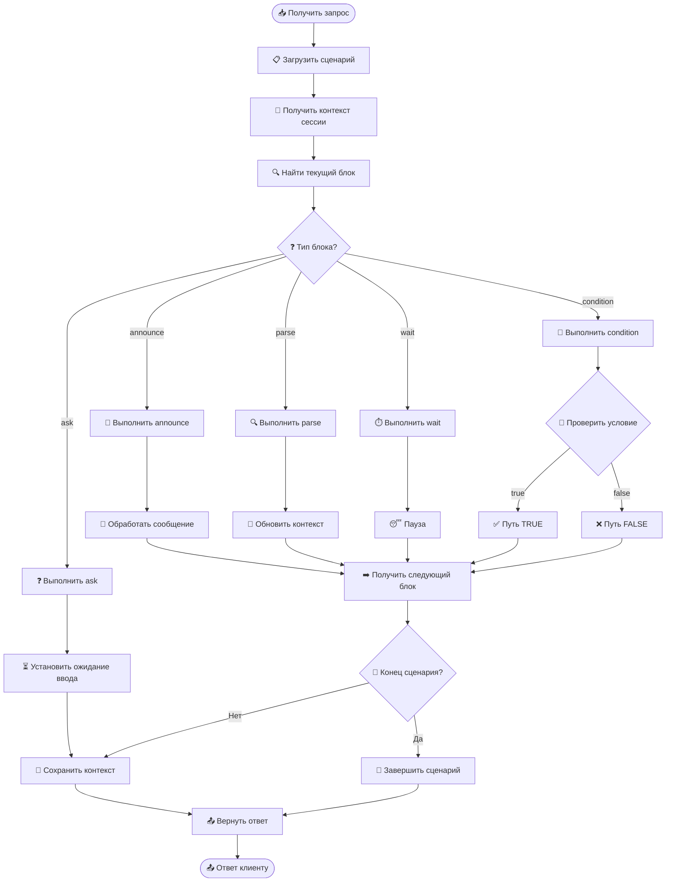

# 🚀 Полная схема работы Chatbot Platform

## 🏗️ Архитектура сервисов

```
┌─────────────────────────────────────────────────────────────────┐
│                    🌐 FRONTEND (React 19.1.1)                   │
│                         [Планируется]                          │
└─────────────────────┬───────────────────────────────────────────┘
                      │ HTTP/WebSocket
┌─────────────────────▼───────────────────────────────────────────┐
│                🚪 API GATEWAY (:8090)                          │
│  ┌─────────────┐ ┌──────────────┐ ┌─────────────────────────┐   │
│  │ 🔐 PowerStone│ │ 👤 Chameleon │ │ 📊 Health Checks       │   │
│  │ Auth        │ │ Sessions     │ │ 📖 Swagger UI          │   │
│  └─────────────┘ └──────────────┘ └─────────────────────────┘   │
└─────────────────────┬───────────────────────────────────────────┘
                      │ Proxy Requests
        ┌─────────────┼─────────────┬─────────────────────────────┐
        │             │             │                             │
┌───────▼──────┐ ┌────▼─────┐ ┌─────▼──────┐ ┌──────────────────┐
│💬 CHAT       │ │🎭 ORCH-  │ │📋 SCENARIO │ │🔧 FUTURE         │
│SERVICE       │ │ESTRATOR  │ │SERVICE     │ │SERVICES          │
│(:8091)       │ │(:8092)   │ │(:8093)     │ │                  │
│              │ │          │ │            │ │                  │
│✅ Работает   │ │⚠️ Доработка│ │✅ Работает │ │📅 Планируется   │
└──────────────┘ └──────────┘ └────────────┘ └──────────────────┘
        │             │             │
        │             │             │
┌───────▼──────┐ ┌────▼─────┐ ┌─────▼──────┐
│🔄 REDIS      │ │🧠 MEMORY │ │📊 PostgreSQL│
│Cache         │ │Context   │ │Database     │
│[Планируется] │ │Storage   │ │[Планируется]│
└──────────────┘ └──────────┘ └─────────────┘
```

## 🔄 Поток выполнения диалога



## 🎯 Детальная схема Orchestrator



## 🗂️ Структура данных

### 📊 Сессия чата
```json
{
  "session_id": "uuid",
  "user_id": "user123",
  "scenario_id": "balance-check-001",
  "current_node": "ask_balance",
  "context": {
    "wantsBalance": false,
    "cardNumber": null,
    "validCard": false,
    "attempts": 0
  },
  "created_at": "2025-09-24T13:00:00Z",
  "updated_at": "2025-09-24T13:05:00Z"
}
```

### 🎭 Выполнение блока
```json
{
  "block_id": "parse_answer",
  "block_type": "parse",
  "input": "Да",
  "context_before": {"wantsBalance": false},
  "context_after": {"wantsBalance": true},
  "next_node": "check_answer",
  "execution_time": 15,
  "timestamp": "2025-09-24T13:05:30Z"
}
```

## 🔧 API Endpoints

### 🚪 API Gateway (:8090)
```
GET  /api/v1/status              - Статус шлюза
POST /api/v1/chat/sessions       - Создать сессию → Chat Service
POST /api/v1/chat/messages       - Отправить сообщение → Chat Service
GET  /api/v1/scenarios           - Получить сценарии → Scenario Service
POST /api/v1/execute/scenario    - Выполнить сценарий → Orchestrator
```

### 💬 Chat Service (:8091)
```
GET  /api/v1/chat/status         - Статус сервиса
POST /api/v1/chat/sessions       - Создать сессию
GET  /api/v1/chat/sessions/{id}  - Получить сессию
POST /api/v1/chat/messages       - Обработать сообщение
DELETE /api/v1/chat/sessions/{id} - Удалить сессию
```

### 🎭 Orchestrator (:8092)
```
GET  /api/v1/execute/status      - Статус оркестратора
POST /api/v1/execute/scenario    - Выполнить сценарий
POST /api/v1/execute/test        - Тестовое выполнение
```

### 📋 Scenario Service (:8093)
```
GET  /api/v1/scenarios/status    - Статус сервиса
GET  /api/v1/scenarios           - Получить все сценарии
GET  /api/v1/scenarios/{id}      - Получить сценарий
POST /api/v1/scenarios           - Создать сценарий
PUT  /api/v1/scenarios/{id}      - Обновить сценарий
DELETE /api/v1/scenarios/{id}    - Удалить сценарий
```

## 📈 Мониторинг и логирование

### 🔍 Health Checks
```
http://localhost:8090/q/health   - API Gateway
http://localhost:8091/q/health   - Chat Service
http://localhost:8092/q/health   - Orchestrator
http://localhost:8093/q/health   - Scenario Service
```

### 📊 Метрики
- Количество активных сессий
- Время выполнения сценариев
- Успешность завершения диалогов
- Ошибки выполнения блоков

### 📝 Логирование
```
2025-09-24 13:05:30 INFO [Chat] Session created: uuid
2025-09-24 13:05:31 INFO [Orchestrator] Executing scenario: balance-check-001
2025-09-24 13:05:32 DEBUG [Orchestrator] Block executed: greeting → ask_balance
2025-09-24 13:05:33 INFO [Chat] User input: "Да" → Bot response: "Введите 4 цифры"
```

## 🚀 Статус реализации

| Компонент | Статус | Функциональность |
|-----------|--------|------------------|
| 🚪 API Gateway | ✅ Готов | Авторизация, проксирование, health checks |
| 💬 Chat Service | ✅ Готов | Сессии, сообщения, простые ответы |
| 📋 Scenario Service | ✅ Готов | CRUD сценариев, поиск, валидация |
| 🎭 Orchestrator | ⚠️ Доработка | Выполнение сценариев (ошибки типизации) |
| 🌐 Frontend | 📅 Планируется | React 19.1.1 интерфейс |
| 📊 Database | 📅 Планируется | PostgreSQL для сценариев |
| 🔄 Cache | 📅 Планируется | Redis для сессий |
